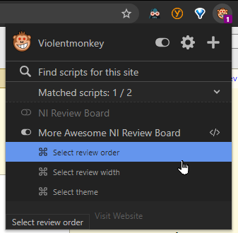

# Userscripts to enhance the Review Board experience

Primarily for use at NI. If you also use Review Board, it is possible that this script can also help you too (with modifications).

## Getting Started

1. Install a userscripts extension — such as [Tampermonkey](https://tampermonkey.net/) or [Violentmonkey](https://violentmonkey.github.io/) — and refresh this page
2. [Install this userscript](https://github.com/ni/reviewboard-userscripts/raw/master/src/ni-reviewboard.user.js)

## What does it do?

### Neat new features!

- Categories reviews into Incomplete, Reviewed, and Ship It groups
- Adds an icon to navigate to file from its diff
- Lets you click anywhere in the header to expand/collapse a comment

### Bringing you info where you expect it!

- Annotates users and groups with their approvals
- Annotates the `.niconfig` owner review block with approvals
- Extracts and annotates `prebuild` results

### Save your eyeballs!

- Restyles the page for a more modern experience
- Changes the default avatar to something more useful and distinguishable
- Gives you options to reverse the sort order, optimize for readability, and even change the background theme
  - 

## Getting Updates

Tampermonkey and Violentmonkey auto update userscripts daily. You can force an update from the extensions menu or the settings page.

## Resources

- [Support and troubleshooting](docs/SUPPORT.md)
- [Contributing to this project](docs/CONTRIBUTING.md)
- [Privacy policy](docs/privacy-policy.md)
- [MIT License](LICENSE.txt)

---

*Made with :heart: by Dev Efficiency*
